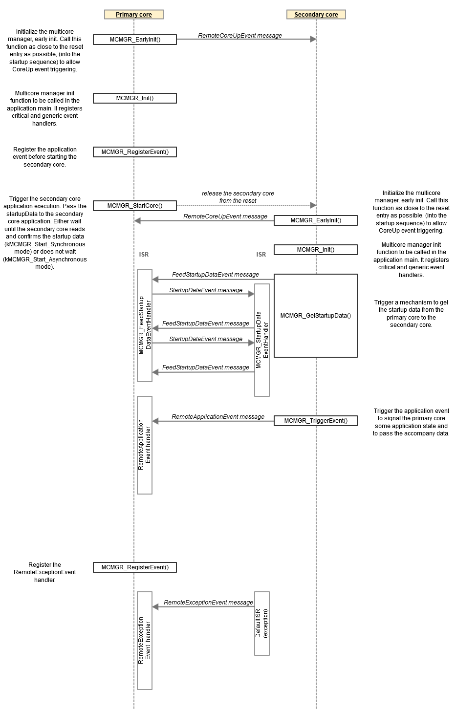

# MCUXpresso SDK : mcuxsdk-middleware-mcmgr (Multicore Manager)

## Overview
This repository is for MCUXpresso SDK Multicore Manager middleware delivery and it contains Multicore Manager component officially provided in NXP MCUXpresso SDK. This repository is part of the MCUXpresso SDK overall delivery which is composed of several sub-repositories/projects. Navigate to the top/parent repository [mcuxsdk](https://github.com/nxp-mcuxpresso/mcuxsdk-manifests/) for the complete delivery of MCUXpresso SDK to be able to build and run Multicore Manager examples that are based on mcux-sdk-middleware-mcmgr component.

## Documentation
Overall details can be reviewed here: [MCUXpresso SDK Online Documentation](https://mcuxpresso.nxp.com/mcuxsdk/latest/html/introduction/README.html)

Visit [Multicore Manager - Documentation](https://mcuxpresso.nxp.com/mcuxsdk/latest/html/middleware/multicore/mcmgr/README.html) to review details on the contents in this sub-repo.

## Setup
Instructions on how to install the MCUXpresso SDK provided from GitHub via west manifest [Getting Started with SDK - Detailed Installation Instructions](https://mcuxpresso.nxp.com/mcuxsdk/latest/html/gsd/installation.html#installation)

## Contribution
We welcome and encourage the community to submit patches directly to the mcmgr project placed on github. Contributing can be managed via pull-requests. Before a pull-request is created the code should be tested and properly formatted.

---------------------------------
# Multicore Manager (MCMGR)

The Multicore Manager (MCMGR) software library provides a number of services for multicore systems. This library is distributed as a part of the Multicore SDK (MCSDK). Together, the MCSDK and the MCUXpresso SDK (SDK) form a framework for development of software for NXP multicore devices.

The MCMGR component is located in the `<MCUXpressoSDK_install_dir>/middleware/multicore/mcmgr` directory.


The Multicore Manager provides the following major functions:

- Maintains information about all cores in system.
- Secondary/auxiliary core(s) startup and shutdown.
- Remote core monitoring and event handling.

## Usage of the MCMGR software component

The main use case of MCMGR is the secondary/auxiliary core start. This functionality is performed by the public API function.

Example of MCMGR usage to start secondary core:

```c
#include "mcmgr.h"

void main()
{
    /* Initialize MCMGR - low level multicore management library.
       Call this function as close to the reset entry as possible,
       (into the startup sequence) to allow CoreUp event triggering. */
    MCMGR_EarlyInit();

    /* Initialize MCMGR, install generic event handlers */
    MCMGR_Init();

    /* Boot secondary core application from the CORE1_BOOT_ADDRESS, pass "1" as startup data, starting synchronously. */
    MCMGR_StartCore(kMCMGR_Core1, CORE1_BOOT_ADDRESS, 1, kMCMGR_Start_Synchronous);
.
.
.
    /* Stop secondary core execution. */
    MCMGR_StopCore(kMCMGR_Core1);
}
```

Some platforms allow stopping and re-starting the secondary core application again, using the MCMGR_StopCore / MCMGR_StartCore API calls. It is necessary to ensure the initially loaded image is not corrupted before re-starting, especially if it deals with the RAM target. Cache coherence has to be considered/ensured as well.

Another important MCMGR feature is the ability for remote core monitoring and handling of events such as reset, exception, and application events.
Application-specific callback functions for events are registered by the MCMGR_RegisterEvent() API. Triggering these events is done using the MCMGR_TriggerEvent() API.
mcmgr_event_type_t enums all possible event types.

An example of MCMGR usage for remote core monitoring and event handling.
Code for the primary side:

```c
#include "mcmgr.h"

#define APP_RPMSG_READY_EVENT_DATA  (1)
#define APP_NUMBER_OF_CORES (2)
#define APP_SECONDARY_CORE kMCMGR_Core1

/* Callback function registered via the MCMGR_RegisterEvent() and triggered by MCMGR_TriggerEvent() called on the secondary core side */
void RPMsgRemoteReadyEventHandler(uint16_t eventData, void *context, mcmgr_core_t coreNum)
{   
    uint16_t *data = &((uint16_t *)context)[coreNum];

    *data = eventData;
}

void main()
{
    uint16_t RPMsgRemoteReadyEventData[NUMBER_OF_CORES] = {0};

    /* Initialize MCMGR - low level multicore management library.
       Call this function as close to the reset entry as possible,
       (into the startup sequence) to allow CoreUp event triggering. */
    MCMGR_EarlyInit();

    /* Initialize MCMGR, install generic event handlers */
    MCMGR_Init();

    /* Register the application event before starting the secondary core */
    MCMGR_RegisterEvent(kMCMGR_RemoteApplicationEvent, RPMsgRemoteReadyEventHandler, (void *)RPMsgRemoteReadyEventData);

    /* Boot secondary core application from the CORE1_BOOT_ADDRESS, pass rpmsg_lite_base address as startup data, starting synchronously. */
    MCMGR_StartCore(APP_SECONDARY_CORE, CORE1_BOOT_ADDRESS, (uint32_t)rpmsg_lite_base, kMCMGR_Start_Synchronous);

    /* Wait until the secondary core application signals the rpmsg remote has been initialized and is ready to communicate. */
    while(APP_RPMSG_READY_EVENT_DATA != RPMsgRemoteReadyEventData[APP_SECONDARY_CORE]) {};
.
.
.
}
```

Code for the secondary side:

```c
#include "mcmgr.h"

#define APP_RPMSG_READY_EVENT_DATA  (1)

void main()
{
    /* Initialize MCMGR - low level multicore management library.
       Call this function as close to the reset entry as possible,
       (into the startup sequence) to allow CoreUp event triggering. */
    MCMGR_EarlyInit();

    /* Initialize MCMGR, install generic event handlers */
    MCMGR_Init();
.
.
.

    /* Signal the to other core that we are ready by triggering the event and passing the APP_RPMSG_READY_EVENT_DATA */
    MCMGR_TriggerEvent(kMCMGR_RemoteApplicationEvent, APP_RPMSG_READY_EVENT_DATA, kMCMGR_Core0);
.
.
.
}
```

## MCMGR Data Exchange Diagram

The following picture shows how the handshakes are supposed to work between the two cores in the MCMGR software.


